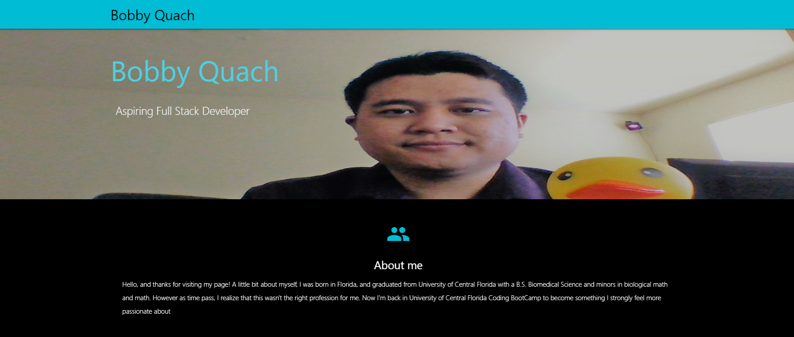

# Portfolio
Link to new Portfolio: https://lov3tt.github.io/BobbyQuach/

>Project 1: Movie & Dinner
https://benjiyamin.github.io/DAAM-App/
Code: https://github.com/benjiyamin/DAAM-App

>Contribution: Front-End Team
No real difficulties
All the problems was solve by google and asking team members.
Had to re-design the project 3+ times, to meet standard.
Solve this by researching what's the current popular style at use.
Google mostly.

